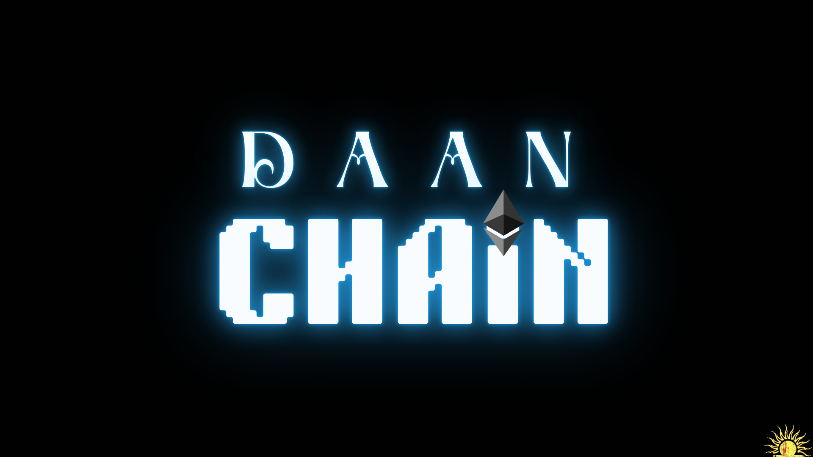
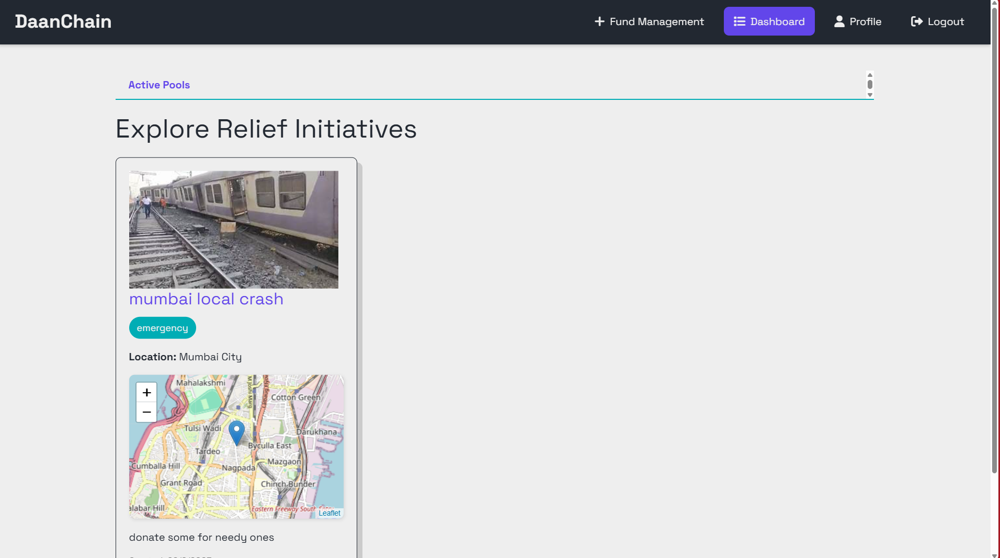
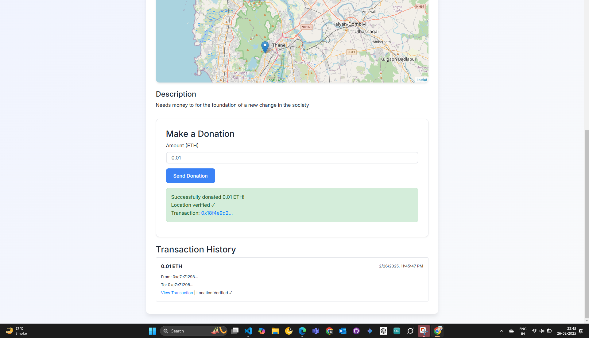
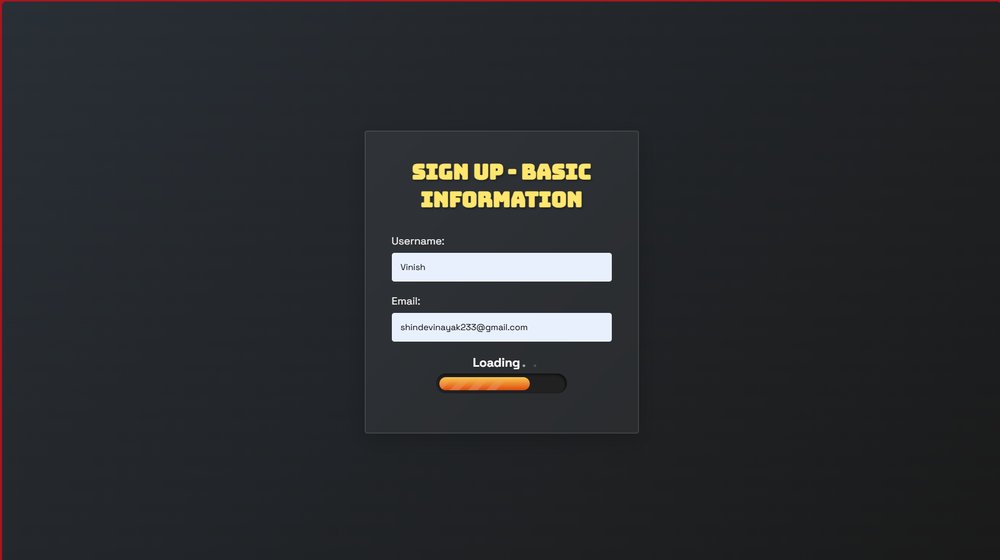
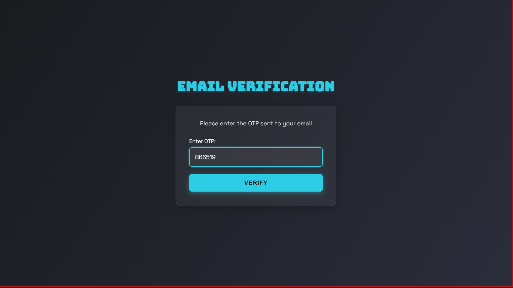
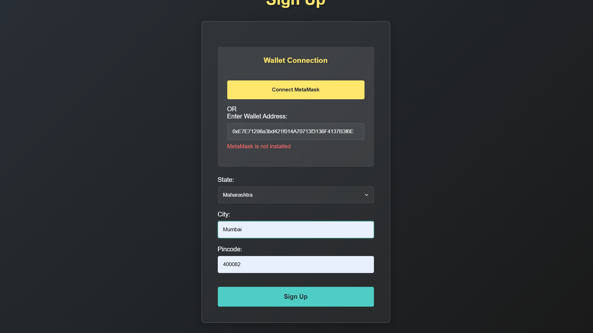
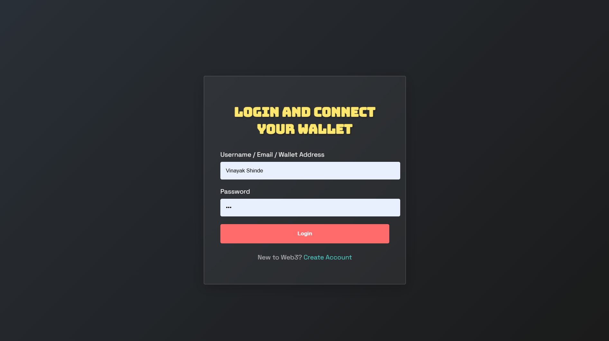
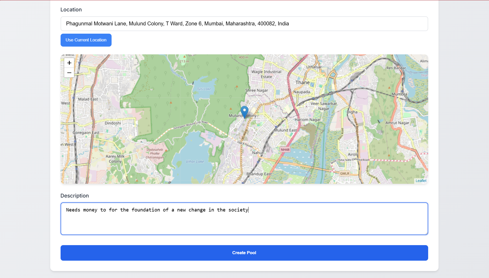
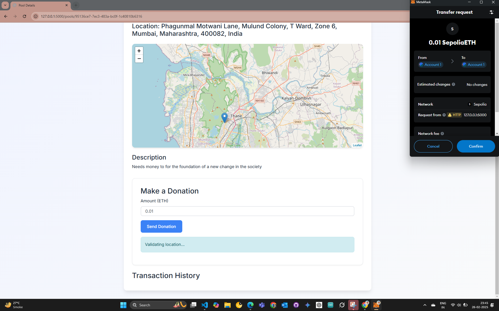
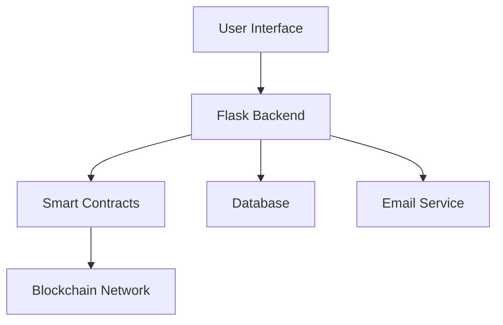

<div align="center">
  
  
  # DaanChain
  
  *Blockchain-Powered Emergency Relief System for Rural India*
  
  [](LICENSE)
  [](https://github.com/yourusername/daanchain)
  
</div>

<p align="center">
  
</p>

## 🌟 Overview

DaanChain revolutionizes emergency relief distribution in rural India through blockchain technology. Our platform ensures transparent, efficient, and secure aid delivery when it matters most.

## ✨ Key Features

<div align="center">
  
</div>

### 🔐 Smart Contract-Powered Fund Management
- Automated fund disbursement
- Transparent transaction tracking
- Real-time audit trails

### 📍 Geo-Verified Aid Distribution
<p align="center">
  
</p>

- Precise location tracking
- Verified delivery confirmation
- Geographic need assessment

### 💎 Blockchain Security
- Decentralized Identity (DID) verification
- Fraud prevention mechanisms
- Immutable transaction records

## 🚀 Getting Started

### Prerequisites
- Node.js (v14+)
- Python 3.8+
- Ganache
- MetaMask

### Installation

```bash
git clone https://github.com/vinayak1729-web/daanchain.git
```

```bash
cd daanchain
```

```bash
pip install -r requirements.txt
```

```bash
npm install
```

## 💫 User Journey

### 1. Account Creation
<p align="center">
  
   
  
 
</p>

### 2. Login & Dashboard
<p align="center">
  
  
</p>

### 3. Pool Creation & Donation
<p align="center">
  
  
</p>

## 🛠️ Technology Stack

<div align="center">

| Frontend | Backend | Blockchain | Security |
|----------|---------|------------|-----------|
| HTML5 | Python | Solidity | JWT |
| CSS3 | Flask | Web3.py | DID |
| JavaScript | SMTP | Ganache | Encryption |

</div>

## 📊 Architecture



## 🌐 API Reference

| Endpoint | Method | Description |
|----------|--------|-------------|
| `/api/pools` | GET/POST | Pool management |
| `/api/transactions` | POST | Process donations |
| `/api/verify` | POST | Location verification |

## 🔜 Roadmap

- [ ] Enhanced DID Integration
- [ ] Multi-chain Support
- [ ] Mobile Application
- [ ] Advanced Analytics Dashboard
- [ ] AI-powered Fraud Detection

## 🤝 Contributing

We welcome contributions! Please see our [Contributing Guidelines](CONTRIBUTING.md) for details.

## 📄 License

This project is licensed under the MIT License - see the [LICENSE](LICENSE) file for details.

## 🙏 Acknowledgments

- Rural Development Ministry
- Blockchain Development Community
- Our Amazing Contributors

<div align="center">

### Made with ❤️ for Rural India

[Website](https://daanchain.org) • [Documentation](https://docs.daanchain.org) • [Report Bug](https://github.com/yourusername/daanchain/issues)

</div>
